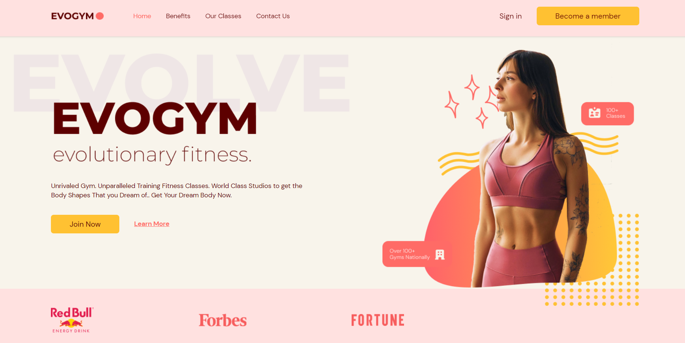
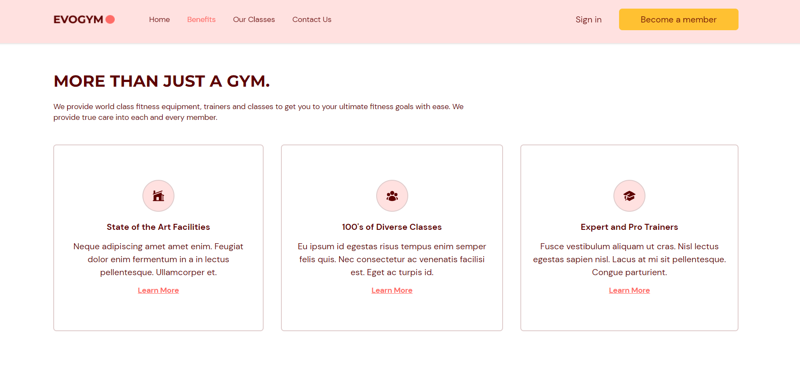
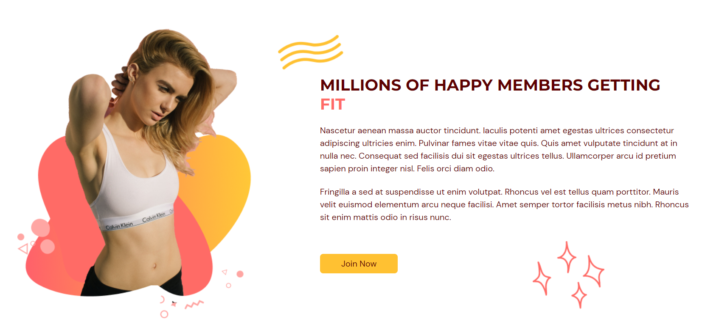
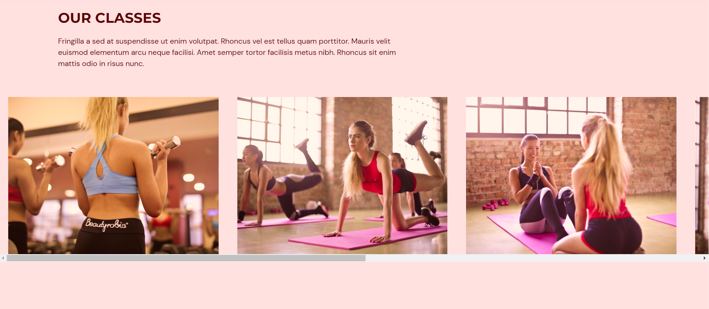
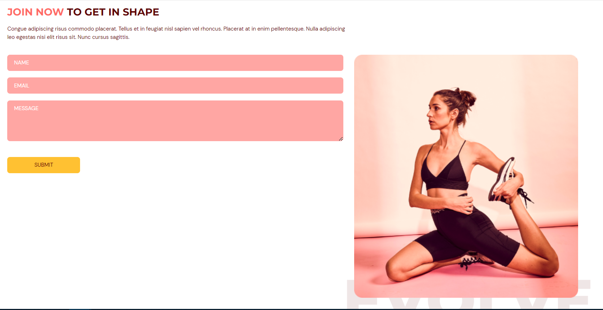
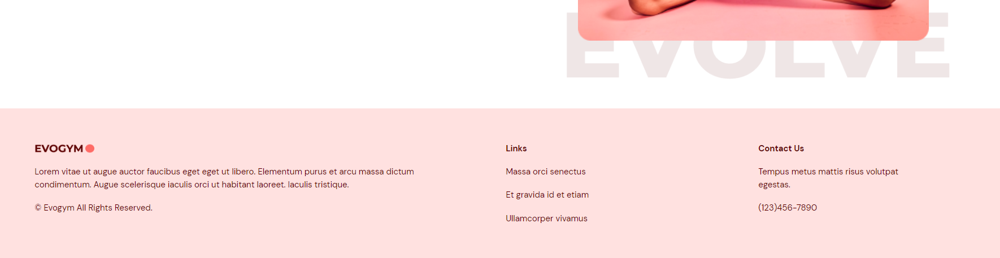

## Fitness Application

[DEMO](https://4a6c2318.alexfitnessgym.pages.dev/)

A responsive frontend app made with ReactTs presenting a gym company.

Complex responsive layouts and animations of different types in each page on section enter.

Formsubmit.co to redirect emails from Contact Us page directly to my email.

Other technologies/libraries used:

- Tailwind CSS & Framer Motion for application design
- React-hook-form for form data
- React-anchor-link-smooth-scroll for page navigation

### App presentation

#### Home section

In the home section we have a nice animation on first page load and a button redirecting us to the contact us section.

#### Benefits section

In this section we can see the sticky navigation and there is an animation for each part of the benefit section.

#### Our Classes section

In this section we have a scrolling horizontal gallery and details about each class on hover.

#### Contact us section

In this section we have a form with data which users can send to the gym's email.

#### Footer section

### What I learned?

In this project my focus was the usage of Tailwind CSS framework so that I can build a complex layout responsive design and more practice with React and Typescript.

How to make nice animations using Framer Motion.

How to style using Tailwind CSS and advanced features of it such as multiple screens, custom design items, responsive layout and hamburger menu.

Email redirection using formsubmit.co.

How to use useForm() from react-hook-form.

Usage of anchors for navigation from react-anchor-link-smooth-scroll.

Use of Vite instead of create-react-app.

### How to run ?

Frontend(client)

> npm run build
